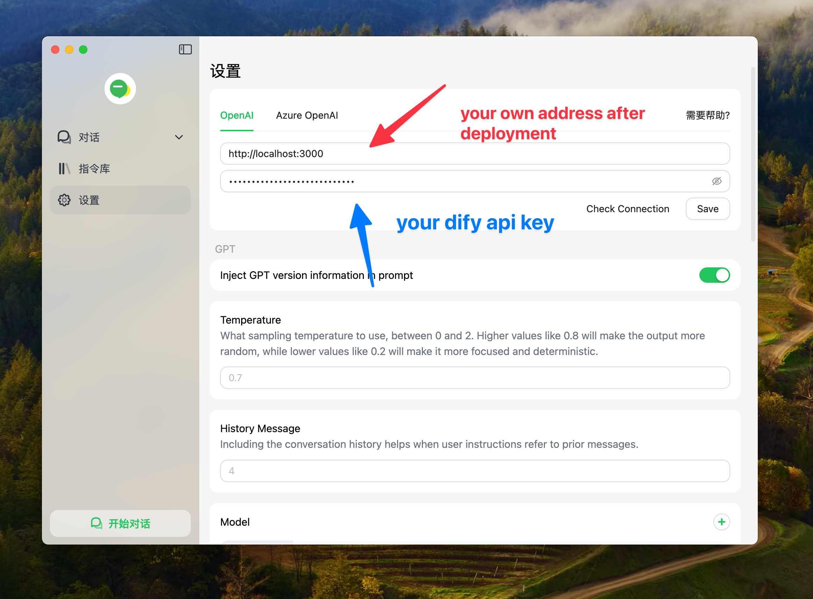

## D2O
**Use Dify on your favorite OpenAI client.**

This project converts the Dify API to the OpenAI API format, giving you access to Dify's LLMs, knowledge base, tools, and workflows within your preferred OpenAI clients.


## Features
- Convert Dify API into an OpenAI API
- Support streaming and blocking
- Support Chat, Completion, Agent and Workflow bots API on dify

## Deployment
### Zeabur
[](https://zeabur.com/templates/92RLEZ?referralCode=fatwang2)

### Vercel
[](https://vercel.com/new/clone?repository-url=https://github.com/fatwang2/dify2openai&env=DIFY_API_URL&envDescription=https://api.dify.ai/v1)

**Note:** Vercel's serverless functions have a 10-second timeout limit.


### Local Deployment
1. Set the environment variable in the .env file
```bash
DIFY_API_URL=https://api.dify.ai/v1
```

2. Install dependencies 
```bash
pnpm install
```

3. Run the project
```bash
pnpm start
```

## Usage
1. OpenAI Clients



2. Code

```JavaScript
const response = await fetch('http://localhost:3000/v1/chat/completions', {
  method: 'POST',
  headers: {
    'Content-Type': 'application/json',
    'Authorization': 'Bearer YOUR_DFIY_API_KEY',
  },
  body: JSON.stringify({
    model: 'dify',
    messages: [
      { role: 'system', content: 'You are a helpful assistant.' },
      { role: 'user', content: 'Hello, how are you?' },
    ],
  }),
});

const data = await response.json();
console.log(data);
```
## Environment Variable
This project provides some additional configuration items set with environment variables:

| Environment Variable | Required | Description                                                                                                                                                               | Example                                                                                                              |
| -------------------- | -------- | ------------------------------------------------------------------------------------------------------------------------------------------------------------------------- | -------------------------------------------------------------------------------------------------------------------- |
| `DIFY_API_URL`     | Yes      | Your Dify API if you self-host it                                                                                                                  | `https://api.dify.ai/v1`                                                                                                 |
| `BOT_TYPE`     | Yes      | The type of your dify bots                                                                                                                  | `Chat,Completion,Workflow`                                                                                                 |
| `INPUT_VARIABLE`     | No      | The name of input variable in your own dify workflow bot                                                                                                                  | `query,text`                                                                                                 |
| `OUTPUT_VARIABLE`     | No      | The name of output variable in your own dify workflow bot                                                                                                                  | `text`                                                                                                 |
## Roadmap
**Coming Soon**
*   Image support
*   Audio-to-text
*   Text-to-audio
*   Docker support

**Available Now**
*   Workflow Bot
*   Variables support
*   Continuous dialogue
*   Zeabur & Vercel deployment
*   Streaming & Blocking
*   Agent & Chat bots

## Contact
Feel free to reach out for any questions or feedback

[X](https://sum4all.site/twitter)\
[telegram](https://sum4all.site/telegram)

<a href="https://www.buymeacoffee.com/fatwang2" target="_blank"></a>

## License
This project is licensed under the MIT License.
